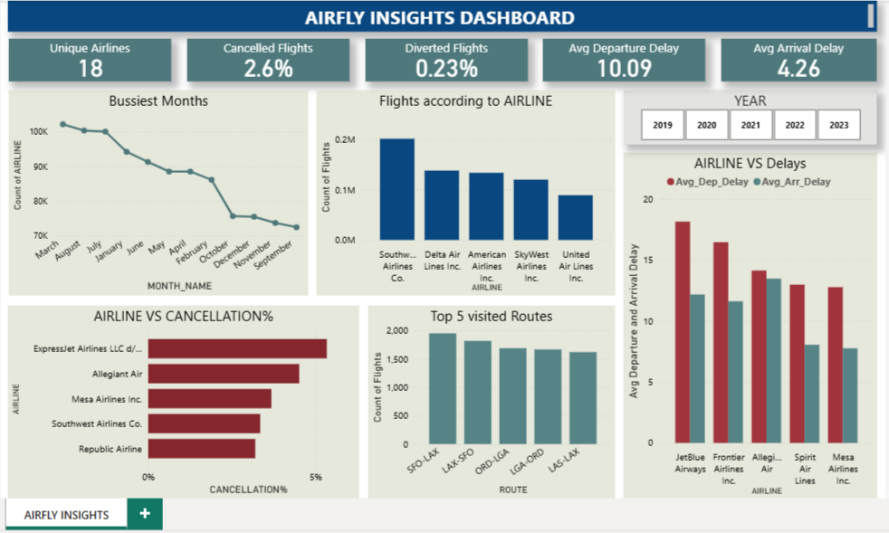

# ✈️ AirFly Insights: Airline Performance Analysis
This project analyzes airline flight data from 2019 to 2023 to uncover trends in delays, cancellations, and route performance. Using Python for data cleaning and exploratory analysis, and Power BI for visualization, the project provides insights into operational efficiency, delay causes, and seasonal patterns to support data-driven decision-making.
*This project was completed as part of the Infosys Springboard Data Analytics Program.*

## 📊 Problem Statement
The airline industry generates large volumes of operational data, including flight schedules, delays, cancellations, and route information. Analyzing this data is essential to identify inefficiencies, understand delay patterns, and improve operational performance.
The goal is to help understand airline and airport-level performance and contribute to actionable insights using visual analysis.

## 📁 Data Description
- Airline dataset covering **2019–2023**
- Contains information on **flight schedules, delays, cancellations, airlines, and routes**
- The dataset has 3M rows and 32 columns
- Refer the AIRFLY_FEATURE_DICT.docx file to understand what each column means

📌 **Raw Dataset Source (Kaggle):**  https://www.kaggle.com/datasets/patrickzel/flight-delay-and-cancellation-dataset-2019-2023

## ⚙️ Methodology
- Performed data understanding and explored dataset structure (~3M records)  
- Handled missing values while retaining meaningful nulls  
- Cleaned inconsistent records and optimized data types  
- Created new features such as Month, Day, and Route  
- Conducted exploratory data analysis and delay analysis  
- Built a Power BI dashboard for visualization and insights
---

## 📊 Dashboard

📌 The Power BI dashboard provides insights into:
- Flight delays and trends  
- Cancellation patterns  
- Airline performance  
- Route-level analysis

#### Due to file size limitations, the Power BI (.pbix) file is not included. Dashboard visual is provided as screenshot.
---

## 📈 Key Analysis
- Approximately 97.4% of flights are successfully completed, while only 2.6% are cancelled, indicating strong overall operational
  reliability.
- Flight activity peaks during July and August, reflecting high seasonal demand, while September records the lowest number of flights.
- The average departure delay is higher than arrival delay across airlines, suggesting that flights tend to recover some lost time during    transit.
- Flight delays are primarily driven by carrier-related issues, followed by late aircraft delays and NAS (air traffic congestion),           indicating both operational inefficiencies and traffic-related constraints.
- Flight cancellations peak during March and April, while November records the lowest cancellation rates. Cancellation rates show minimal    impact during holiday months (November and December).
- Cancellation analysis indicates that most flights are cancelled due to weather and security issues.
  A: Carrier-related
  B: Weather
  C: NAS (Air Traffic System)
  D: Security
  NC: Not Cancelled
---

## 💡 Recommendations
- Airlines should optimize internal operations such as crew scheduling, aircraft maintenance, and ground handling to reduce carrier-         related delays.
- Since departure delays are higher, airlines should improve turnaround time and boarding processes to minimize initial delays.
- Airlines should enhance resource allocation during peak months (July, August, March) and busy weekdays to manage high demand efficiently.
- Airlines should strengthen weather risk management using predictive analytics and contingency planning to reduce cancellations.
- Airlines should focus on high-delay routes (e.g., FOD–DEN, DEN–ABE) and underperforming airlines to implement targeted improvements.
---

## 🛠️ Tools & Skills Used
**Tools:**
- Python Jupyter Notebook
- Power BI

**Libraries:** Pandas, NumPy, Matplotlib, Seaborn  

**Skills:**
- Data Cleaning  
- Exploratory Data Analysis (EDA)  
- Data Visualization  
- Feature Engineering  
- Business Insight Generation  
---

## 📂 Project Files 
- **AIRFLY_FEATURE_DICT.docx** - Sample dataset and data dictionary
- **FinalAirFlyInsights.ipynb** - Jupyter Notebook with complete analysis 
- **Airline_Performance_Analysis_PPT.pdf** - Final presentation  
- **images/**- Dashboard photo which is used in README.md
---

## ⚠️ Note on Missing Values
- The dataset contains null values in columns such as **DepDelay, DepTime, TaxiIn, TaxiOut, WheelsOn, and WheelsOff**.  
- These nulls occur due to **cancelled or diverted flights**, where actual flight operations did not take place.  
- Since the real values are unavailable, these nulls were **intentionally retained** to avoid incorrect data imputation.  
- These are considered **valid nulls** and are important for accurate cancellation and disruption analysis. 
